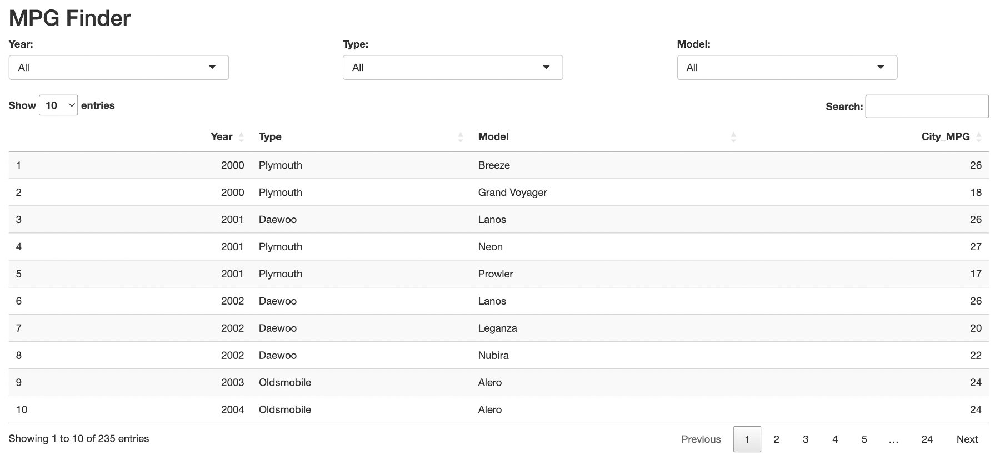
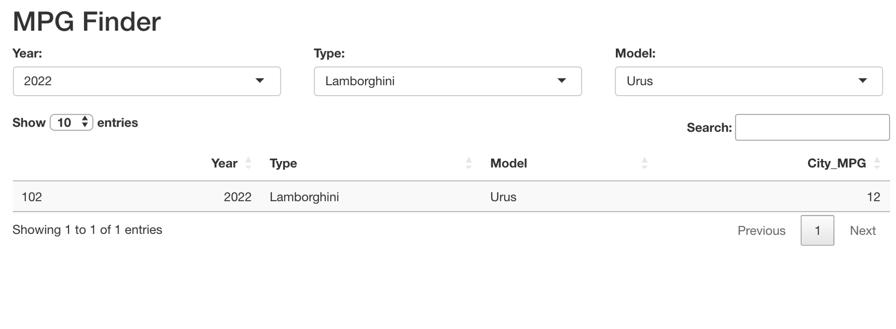
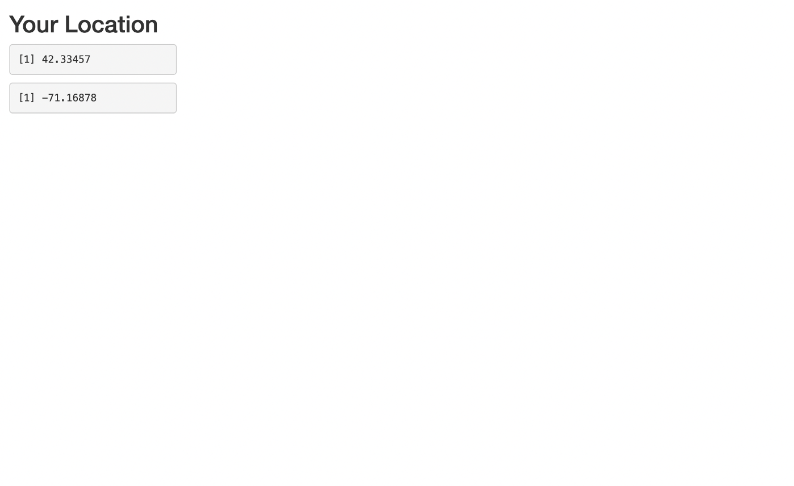
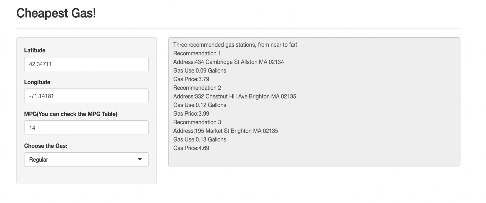

# Gas Finder: A Location-Aware Gas Price Recommender

Gas Finder is an interactive R Shiny application that helps drivers find the **cheapest nearby gas stations** in the Boston area based on real-time scraped gas prices and personalized car fuel efficiency (MPG). The app also integrates geolocation features and driving distance calculations to provide practical recommendations.

---

## Key Features

### Real-Time Gas Price Scraper
- Scrapes gas station names, addresses, and **Regular/Premium** gas prices by ZIP code.
- Data source: [`https://www.autoblog.com/`](https://www.autoblog.com/)  
  ⚠️ **Note**: The layout of this website may have changed. Scraping code may require adjustments.

### MPG Lookup Tool
- Allows users to look up city MPG values based on **vehicle make, model, and year**.
- MPG data scraped and cleaned from Autoblog’s research pages.

### Location-Based Gas Recommendation
- Uses the **Google Maps API** to:
  - Get user’s geolocation (via browser)
  - Compute driving distances to gas stations
- Recommends **top 3 cheapest stations near you** by cost and efficiency.

---

## Technologies Used

- `R`, `Shiny`, `rvest`, `polite`, `httr`, `tidyverse`
- `googleway`, `ggmap` for geolocation and distance APIs
- `DT` for dynamic data tables
- Google Maps Distance Matrix & Geocoding APIs

---

## File Structure

```
├── GasFinder.Rmd                # Main project code with UI & logic
├── final_project.csv            # Combined gas station data (prices + geolocation)
├── CLEANDATA_FINAL.csv          # Cleaned MPG dataset
├── final_project_normal.csv     # Regular gas prices
├── final_project_premium.csv    # Premium gas prices
└── README.md
```

---

## How to Run

1. Clone the repository:
   ```bash
   git clone https://github.com/TEDDYZ11/gas-finder.git
   cd gas-finder
   ```

2. Open `GasFinder.Rmd` or run the Shiny app directly.

3. Before running:
   - Add your **Google Maps API key**:
     ```r
     register_google(key = "YOUR_API_KEY_HERE")
     ```
   - Or store it securely in a `.Renviron` file:
     ```
     GOOGLE_API_KEY=your_key_here
     ```

---

##  Notes

- Autoblog’s structure may change over time. If scraping fails, update the `rvest` selectors.
- Some paths are set to local files. Adjust them if needed, or replace with relative paths.
- This project is built for educational and demonstration purposes only.

---

## Screenshots

**1. MPG Finder UI - Full List**  


**2. MPG Finder UI - Filtered for Lamborghini Urus (2022)**  


**3. User Location Detection**  


**4. Cheapest Gas Recommendations**  



---

